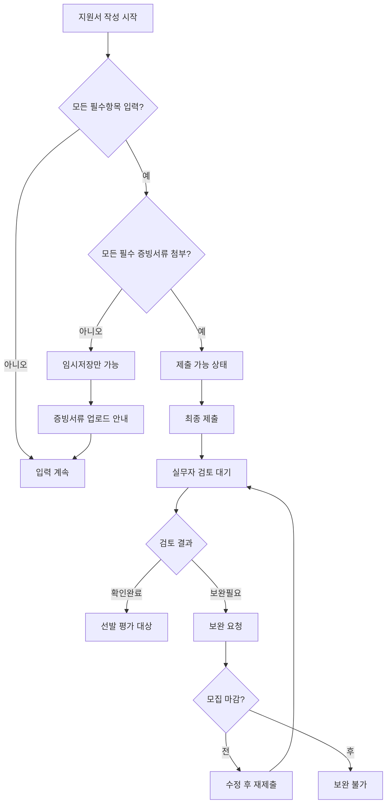

# 코치협회 역량 데이터베이스 서비스 최종 설계서 v3.0

**문서 버전**: 3.0 Final (피드백 반영)  
**작성일**: 2025-11-02  
**프로젝트명**: 코치 역량 데이터베이스 및 프로젝트 매칭 시스템

---

## 1. 주요 변경사항 및 확정사항

### 1.1 핵심 정책 결정사항

| 구분 | 정책 | 비고 |
|-----|------|-----|
| **제출 조건** | 모든 필수 증빙서류 첨부 필수 | 미첨부시 임시저장만 가능 |
| **점수 공개** | 코치에게 점수 비공개 | 운영자/실무자만 확인 |
| **보완 정책** | 모집마감 전까지 무제한 보완 | 기한/횟수 제한 없음 |
| **데이터 유효기간** | 영구 유효 | 6개월마다 업데이트 권장 메일 |
| **데이터 보관** | 영구 보관 원칙 | 증빙파일 5년, 탈퇴자 데이터도 보존 |
| **실무자 권한** | 모든 항목 검토 가능 | 권한 세분화 불필요 |
| **동시 검토** | 여러 실무자 동시 검토 가능 | 항목별 분담 가능 | 단, 실무자가 특정 지원자의 특정 항목을 클릭하는 순간 해당 항목을 '검토중(locked)' 상태로 변경하고, 다른 실무자가 접근 시 "OOO 실무자가 검토 중"이라고 표시하는 것이 좋습니다.

### 1.2 단계별 구현 범위

#### Phase 1 (MVP - 3개월)
- ✅ 프로젝트 생성/관리
- ✅ 지원서 작성/제출
- ✅ **역량 재사용 (핵심 차별화)**
- ✅ 증빙서류 검토
- ✅ 선발 프로세스

#### Phase 2 (2차 - 2개월)
- ⏳ 보완통지 자동화
- ⏳ Excel 업로드/다운로드
- ⏳ 이메일/SMS 발송 시스템
- ⏳ 본인인증
- ⏳ 6개월 주기 정보 업데이트 리마인드
- ⏳ 고급 통계/리포트

---

## 2. 수정된 핵심 프로세스

### 2.1 지원서 제출 프로세스 (수정)



### 2.2 점수 관리 체계 (수정)

```javascript
// 점수 계산은 서버에서만 처리, 코치에게는 비공개
class ScoreManager {
  calculateScore(applicationData, criteria) {
    let totalScore = 0;
    
    applicationData.forEach(item => {
      // 필수 증빙 미제출시 0점
      if (item.proofRequired && !item.fileId) {
        item.score = 0;
        item.status = 'incomplete';
        return;
      }
      
      // 검토 완료된 항목만 점수 부여
      if (item.verificationStatus === 'approved') {
        item.score = this.getScoreByC criteria(item.value, criteria);
        totalScore += item.score;
      }
    });
    
    return {
      autoScore: totalScore,
      visibility: 'admin_only', // 코치에게 비공개
      calculatedAt: new Date()
    };
  }
}
```

### 2.3 보완 프로세스 (간소화)

```javascript
// Phase 1: 수동 보완 통지
{
  supplementRequest: {
    method: "manual",
    process: [
      "실무자가 '보완필요' 선택",
      "보완 사유 작성",
      "코치가 시스템 로그인시 알림 확인",
      "모집 마감 전까지 자유롭게 수정"
    ]
  }
}

// Phase 2: 자동 보완 통지
{
  supplementRequest: {
    method: "automated",
    process: [
      "보완필요 체크시 자동 이메일 발송",
      "시스템 내 실시간 알림",
      "보완 현황 대시보드"
    ]
  }
}
```

---

## 3. 수정된 화면 설계

### 3.1 코치 대시보드 (C-01) - 통합형

```
┌──────────────────────────────────────────────────────────┐
│  코치 대시보드                         홍길동님 | 로그아웃 │
├──────────────────────────────────────────────────────────┤
│                                                          │
│  🔔 알림 (2)                                             │
│  ┌────────────────────────────────────────────────┐      │
│  │ • [긴급] 2025 청소년 코칭 - 서류 보완 요청      │      │
│  │ • [안내] 2025 대학생 코칭 - 선발 결과 발표      │      │
│  └────────────────────────────────────────────────┘      │
│                                                          │
│  📋 진행중인 프로젝트 (우선순위 1)                        │
│  ┌────────────────────────────────────────────────┐      │
│  │ 2025 청소년 진로코칭          모집: ~3/15       │      │
│  │ 모집인원: 20명 | 현재: 45명   [지원하기]        │      │
│  ├────────────────────────────────────────────────┤      │
│  │ 2025 대학생 취업코칭          모집: ~3/31       │      │
│  │ 모집인원: 15명 | 현재: 23명   [지원하기]        │      │
│  └────────────────────────────────────────────────┘      │
│                                                          │
│  📊 내 지원 현황 (우선순위 3)                             │
│  ┌────────────────────────────────────────────────┐      │
│  │ 프로젝트명         상태        결과    액션      │      │
│  │ 2025 청소년 코칭   보완필요    -      [수정]     │      │
│  │ 2024 겨울 코칭     완료        선발   [보기]     │      │
│  │ 2024 가을 코칭     완료        탈락   [보기]     │      │
│  └────────────────────────────────────────────────┘      │
│                                                          │
│  💼 내 역량 완성도 (우선순위 4)                           │
│  ┌────────────────────────────────────────────────┐      │
│  │ 전체 완성도: ████████░░ 85%                     │      │
│  │ • 확인완료: 7개 항목                            │      │
│  │ • 검토중: 2개 항목                              │      │
│  │ • 미입력: 1개 항목        [역량 관리 바로가기]   │      │
│  └────────────────────────────────────────────────┘      │
│                                                          │
└──────────────────────────────────────────────────────────┘
```

### 3.2 지원서 작성 화면 (C-05) - 제출 조건 명시

```
┌──────────────────────────────────────────────────────────┐
│  2025 청소년 진로코칭 - 지원서 작성                       │
├──────────────────────────────────────────────────────────┤
│                                                          │
│  ⚠️ 제출 조건: 모든 필수(*) 항목의 증빙서류 첨부 필요      │
│                                                          │
│  진행 상황: ████████░░ 80% (8/10 항목 완료)             │
│                                                          │
│  ┌─────────────────────────────────────────────────┐    │
│  │ 평가 항목                                        │    │
│  ├─────────────────────────────────────────────────┤    │
│  │                                                  │    │
│  │ 1. KCA 자격 * (증빙필수)              ✅ 완료    │    │
│  │    현재값: KSC (2025-01-20 확인완료)             │    │
│  │    [이 정보 사용중]                              │    │
│  │                                                  │    │
│  │ 2. 코칭 경력시간 * (증빙필수)         ⏳ 검토중   │    │
│  │    현재값: 1500시간 이상                         │    │
│  │    첨부파일: experience.pdf                      │    │
│  │    [파일 재업로드]                               │    │
│  │                                                  │    │
│  │ 3. 관련 학위 * (증빙필수)             ❌ 미완성   │    │
│  │    [선택하세요 ▼]                                │    │
│  │    [파일 선택] ← 필수 첨부                       │    │
│  │    ⚠️ 증빙서류를 첨부해야 제출 가능합니다         │    │
│  │                                                  │    │
│  └─────────────────────────────────────────────────┘    │
│                                                          │
│  제출 가능 상태: ❌ 불가 (필수 증빙서류 미첨부)           │
│                                                          │
│  [이전] [임시저장] [다음] [제출(비활성)]                  │
│                                                          │
└──────────────────────────────────────────────────────────┘
```

### 3.3 실무자 검토 화면 (R-04) - 동시 검토 지원

```
┌──────────────────────────────────────────────────────────┐
│  지원서 검토 - 김코치 (2025 청소년 진로코칭)              │
├──────────────────────────────────────────────────────────┤
│                                                          │
│  검토 상태: 3/10 항목 완료 | 다른 실무자 검토중: 2명       │
│                                                          │
│ ┌──────────┬───────────────────────────────────────┐    │
│ │ 검토항목 │           상세 내용                    │    │
│ ├──────────┼───────────────────────────────────────┤    │
│ │ ✅ KCA   │ [이미정 실무자가 10분 전 검토완료]     │    │
│ │    자격  │ 상태: 확인완료                        │    │
│ ├──────────┼───────────────────────────────────────┤    │
│ │ 🔒 코칭  │ [박철수 실무자가 검토중...]           │    │
│ │   경력   │ 다른 실무자 검토중                    │    │
│ ├──────────┼───────────────────────────────────────┤    │
│ │ ⏳ 관련  │ 제출값: 박사                          │    │
│ │   학위   │ 첨부: degree.pdf [미리보기]          │    │
│ │ [선택됨] │                                       │    │
│ │          │ ┌─────────────────────────────────┐   │    │
│ │          │ │     PDF 뷰어 영역                │   │    │
│ │          │ │   (학위증명서 내용 표시)         │   │    │
│ │          │ └─────────────────────────────────┘   │    │
│ │          │                                       │    │
│ │          │ 검토 결과:                           │    │
│ │          │ ○ 확인완료                          │    │
│ │          │ ○ 보완필요                          │    │
│ │          │                                       │    │
│ │          │ 보완사유: (보완필요 선택시 활성화)    │    │
│ │          │ [_____________________________]     │    │
│ │          │                                       │    │
│ │          │ [저장] [다음 미검토 항목]            │    │
│ └──────────┴───────────────────────────────────────┘    │
│                                                          │
│  검토 이력                                               │
│  • 10:30 이미정: KCA자격 확인완료                        │
│  • 10:25 박철수: 코칭경력 검토 시작                      │
│                                                          │
└──────────────────────────────────────────────────────────┘
```

### 3.4 운영자 프로젝트 생성 (A-02) - 항목 구성

```
┌──────────────────────────────────────────────────────────┐
│  새 프로젝트 생성 - Step 2: 수집항목 설정                 │
├──────────────────────────────────────────────────────────┤
│                                                          │
│  📝 정보수집 항목 (점수 없음)                             │
│  ┌─────────────────────────────────────────────────┐    │
│  │ ☑ 이름 (자동)                                    │    │
│  │ ☑ 성별 (자동)                                    │    │
│  │ ☑ 이메일 (자동)                                  │    │
│  │ ☑ 전화번호                                       │    │
│  │ ☑ 생년월일                                       │    │
│  │ ☑ 거주지                                         │    │
│  └─────────────────────────────────────────────────┘    │
│                                                          │
│  📊 평가항목 (점수 있음)                                  │
│  ┌─────────────────────────────────────────────────┐    │
│  │ [기존 항목에서 선택]                             │    │
│  │ ☑ KCA 자격 (증빙필수)              배점: [10]   │    │
│  │ ☑ 총 코칭 경력시간 (증빙필수)      배점: [10]   │    │
│  │ ☑ 관련 학위 (증빙필수)            배점: [10]   │    │
│  │ ☐ 진로자격증                      배점: [__]   │    │
│  │ ☑ 청소년 코칭경험 (증빙필수)      배점: [20]   │    │
│  │                                                  │    │
│  │ [+ 새 평가항목 추가]                            │    │
│  │ 항목명: [청소년 멘토링 경험]                    │    │
│  │ 입력유형: [선택형 ▼]                            │    │
│  │ 선택옵션: [있음, 없음]                          │    │
│  │ 증빙필수: ☑                      배점: [15]    │    │
│  └─────────────────────────────────────────────────┘    │
│                                                          │
│  💬 기타입력 항목 (점수 없음)                             │
│  ┌─────────────────────────────────────────────────┐    │
│  │ ☑ 지원동기 (텍스트, 500자)                      │    │
│  │ [+ 새 항목 추가]                                │    │
│  │ 항목명: [특별 역량 기술]                        │    │
│  │ 입력유형: [텍스트 ▼]                            │    │
│  │ 최대길이: [1000]자                              │    │
│  └─────────────────────────────────────────────────┘    │
│                                                          │
│  총 배점: 65점                                           │
│                                                          │
│  [이전 단계] [임시저장] [다음 단계: 평가기준 설정]        │
│                                                          │
└──────────────────────────────────────────────────────────┘
```

---

## 4. 데이터베이스 수정사항

### 4.1 주요 테이블 변경

#### APPLICATIONS 테이블 (수정)
```sql
CREATE TABLE applications (
    application_id BIGSERIAL PRIMARY KEY,
    project_id INT NOT NULL REFERENCES projects(project_id),
    user_id BIGINT NOT NULL REFERENCES users(user_id),
    status ENUM('draft', 'submitted', 'reviewing', 'completed'),
    auto_score DECIMAL(5,2),
    final_score DECIMAL(5,2),
    score_visibility ENUM('admin_only', 'public') DEFAULT 'admin_only',
    can_submit BOOLEAN DEFAULT FALSE, -- 모든 필수 증빙 첨부시 true
    submitted_at TIMESTAMP,
    last_updated TIMESTAMP DEFAULT CURRENT_TIMESTAMP,
    
    UNIQUE KEY uk_project_user (project_id, user_id),
    INDEX idx_status (status),
    INDEX idx_submitted (submitted_at)
);
```

#### REVIEW_LOCKS 테이블 (신규 - 동시 검토 방지)
```sql
CREATE TABLE review_locks (
    lock_id BIGSERIAL PRIMARY KEY,
    application_id BIGINT NOT NULL REFERENCES applications(application_id),
    item_id INT NOT NULL REFERENCES competency_items(item_id),
    reviewer_id BIGINT NOT NULL REFERENCES users(user_id),
    locked_at TIMESTAMP DEFAULT CURRENT_TIMESTAMP,
    expires_at TIMESTAMP, -- 30분 후 자동 해제
    
    UNIQUE KEY uk_app_item (application_id, item_id),
    INDEX idx_expires (expires_at)
);
```

#### COMPETENCY_REMINDERS 테이블 (Phase 2용)
```sql
CREATE TABLE competency_reminders (
    reminder_id BIGSERIAL PRIMARY KEY,
    user_id BIGINT NOT NULL REFERENCES users(user_id),
    last_reminder_sent TIMESTAMP,
    next_reminder_date DATE,
    reminder_count INT DEFAULT 0,
    
    INDEX idx_next_reminder (next_reminder_date)
);
```

### 4.2 데이터 보관 정책 구현

```sql
-- 데이터 보관 정책 테이블
CREATE TABLE data_retention_policy (
    policy_id SERIAL PRIMARY KEY,
    data_type VARCHAR(50),
    retention_period_years INT,
    action_on_expiry ENUM('archive', 'delete', 'anonymize'),
    is_active BOOLEAN DEFAULT TRUE
);

-- 초기 정책 설정
INSERT INTO data_retention_policy (data_type, retention_period_years, action_on_expiry) VALUES
('application_data', 9999, 'archive'),     -- 영구보관
('coach_competencies', 9999, 'archive'),   -- 영구보관
('files', 5, 'archive'),                   -- 5년 후 아카이빙
('audit_logs', 3, 'delete'),              -- 3년 후 삭제
('user_data', 9999, 'anonymize');         -- 탈퇴시 익명화
```

---

## 5. API 수정사항

### 5.1 제출 가능 여부 체크 API

```javascript
// 제출 가능 상태 확인
GET /api/applications/{id}/submission-status

Response:
{
  "canSubmit": false,
  "reason": "missing_required_documents",
  "missingItems": [
    {
      "itemId": 3,
      "itemName": "관련 학위",
      "required": true,
      "hasDocument": false
    }
  ],
  "completedItems": 8,
  "totalRequired": 9
}
```

### 5.2 동시 검토 관리 API

```javascript
// 검토 항목 잠금
POST /api/reviews/applications/{appId}/items/{itemId}/lock
Response:
{
  "locked": true,
  "lockedBy": "reviewer_name",
  "expiresIn": 1800 // 30분
}

// 검토 항목 잠금 해제
DELETE /api/reviews/applications/{appId}/items/{itemId}/lock

// 현재 검토 상태 조회
GET /api/reviews/applications/{appId}/review-status
Response:
{
  "reviewers": [
    {
      "reviewerId": 102,
      "name": "이미정",
      "reviewingItems": [1, 2],
      "completedItems": [1]
    },
    {
      "reviewerId": 103,
      "name": "박철수",
      "reviewingItems": [3],
      "completedItems": []
    }
  ]
}
```

### 5.3 보완 요청 API (Phase 1 - 수동)

```javascript
// 보완 필요 항목 조회
GET /api/reviews/supplement-requests
Response:
{
  "pendingSupplements": [
    {
      "applicationId": 501,
      "applicantName": "김코치",
      "projectName": "2025 청소년 진로코칭",
      "items": [
        {
          "itemName": "관련 학위",
          "reason": "학위증명서가 흐릿하여 확인 불가",
          "requestedAt": "2025-03-10T10:30:00Z"
        }
      ],
      "deadline": "2025-03-15T23:59:59Z" // 모집 마감일
    }
  ]
}
```

---

## 6. 구현 우선순위 재정의

### 6.1 Phase 1 (MVP - 3개월)

#### Month 1: 기초 시스템
- 주차 1-2: 데이터베이스 구축, 인증 시스템
- 주차 3-4: 운영자 - 프로젝트 생성/관리

#### Month 2: 핵심 기능
- 주차 5-6: 코치 - 역량 관리 (전자지갑)
- 주차 7-8: 코치 - 지원서 작성 (**역량 재사용 포함**)

#### Month 3: 검토 및 선발
- 주차 9-10: 실무자 - 증빙서류 검토 (동시 검토 지원)
- 주차 11-12: 선발 프로세스, 테스트 및 안정화

### 6.2 Phase 2 (확장 - 2개월)

#### Month 4: 자동화
- 보완통지 자동 이메일 발송
- Excel 업/다운로드
- 6개월 주기 업데이트 리마인드

#### Month 5: 고도화
- 고급 통계 및 리포트
- SMS 알림
- 본인인증 시스템

---

## 7. 핵심 비즈니스 로직

### 7.1 제출 가능 여부 판단 로직

```javascript
class ApplicationSubmissionValidator {
  canSubmit(application) {
    const requiredItems = application.items.filter(i => i.required);
    
    // 모든 필수 항목 체크
    for (const item of requiredItems) {
      // 필수 항목 미입력
      if (!item.value) {
        return {
          canSubmit: false,
          reason: 'missing_required_field',
          itemName: item.name
        };
      }
      
      // 증빙필수 항목인데 파일 없음
      if (item.proofRequired && !item.fileId) {
        return {
          canSubmit: false,
          reason: 'missing_required_document',
          itemName: item.name
        };
      }
    }
    
    return { canSubmit: true };
  }
}
```

### 7.2 동시 검토 관리 로직

```javascript
class ReviewConcurrencyManager {
  async acquireLock(applicationId, itemId, reviewerId) {
    // 기존 잠금 확인
    const existingLock = await ReviewLock.findOne({
      where: { applicationId, itemId },
      where: { expiresAt: { $gt: new Date() } }
    });
    
    if (existingLock && existingLock.reviewerId !== reviewerId) {
      return {
        success: false,
        lockedBy: existingLock.reviewerName,
        message: '다른 실무자가 검토중입니다'
      };
    }
    
    // 잠금 생성 또는 갱신
    const lock = await ReviewLock.upsert({
      applicationId,
      itemId,
      reviewerId,
      lockedAt: new Date(),
      expiresAt: new Date(Date.now() + 30 * 60 * 1000) // 30분
    });
    
    return { success: true, lock };
  }
  
  async releaseLock(applicationId, itemId, reviewerId) {
    await ReviewLock.destroy({
      where: { applicationId, itemId, reviewerId }
    });
  }
}
```

### 7.3 역량 재사용 로직 (핵심 차별화)

```javascript
class CompetencyReuseService {
  async reuseCompetency(applicationId, itemId, userId) {
    // 기존 확인완료 역량 조회
    const existingCompetency = await CoachCompetency.findOne({
      where: {
        userId,
        itemId,
        status: 'approved'
      }
    });
    
    if (!existingCompetency) {
      return {
        success: false,
        message: '재사용 가능한 확인완료 정보가 없습니다'
      };
    }
    
    // 지원서에 연결
    await ApplicationData.upsert({
      applicationId,
      itemId,
      competencyId: existingCompetency.id,
      submittedValue: existingCompetency.value,
      submittedFileId: existingCompetency.fileId,
      verificationStatus: 'approved',
      itemScore: await this.calculateScore(itemId, existingCompetency.value)
    });
    
    return {
      success: true,
      message: '기존 정보를 성공적으로 재사용했습니다',
      value: existingCompetency.value,
      verifiedAt: existingCompetency.verifiedAt
    };
  }
}
```

---

## 8. 보안 및 데이터 관리

### 8.1 민감 정보 관리

```javascript
// 개인정보 마스킹
class PrivacyManager {
  maskPersonalInfo(user, viewerRole) {
    if (viewerRole === 'admin') return user; // 운영자는 전체 조회
    
    return {
      ...user,
      name: this.maskName(user.name),
      email: this.maskEmail(user.email),
      phone: this.maskPhone(user.phone),
      birthDate: user.birthDate ? '****-**-**' : null
    };
  }
  
  maskName(name) {
    if (!name || name.length < 2) return '***';
    return name[0] + '*'.repeat(name.length - 1);
  }
  
  maskEmail(email) {
    const [local, domain] = email.split('@');
    return local.substring(0, 2) + '***@' + domain;
  }
}
```

### 8.2 탈퇴자 데이터 처리

```javascript
class UserDeletionService {
  async deleteUser(userId) {
    // 사용자 정보 익명화 (데이터는 보존)
    await User.update({
      name: `탈퇴회원_${userId}`,
      email: `deleted_${userId}@anonymous.com`,
      phone: null,
      status: 'deleted',
      deletedAt: new Date()
    }, {
      where: { userId }
    });
    
    // 역량 데이터는 보존 (연구/통계 목적)
    // 단, 개인 식별 불가능하도록 처리
    await CoachCompetency.update({
      isAnonymized: true
    }, {
      where: { userId }
    });
    
    // 증빙 파일은 5년 후 삭제 예약
    await ScheduledDeletion.create({
      targetType: 'user_files',
      targetId: userId,
      scheduledFor: new Date(Date.now() + 5 * 365 * 24 * 60 * 60 * 1000)
    });
  }
}
```

---

## 9. 테스트 시나리오

### 9.1 핵심 기능 테스트

#### 시나리오 1: 역량 재사용 (Phase 1 핵심)
```gherkin
Feature: 역량 재사용
  Scenario: 확인완료된 역량 재사용
    Given 코치가 이전 프로젝트에서 KCA 자격을 "확인완료" 받음
    When 새 프로젝트 지원시 해당 항목 선택
    Then "이 정보 사용" 버튼이 활성화됨
    And 클릭시 자동으로 값과 증빙이 연결됨
    And 점수가 자동 계산됨 (코치에게는 비공개)
```

#### 시나리오 2: 제출 조건 검증
```gherkin
Feature: 제출 조건
  Scenario: 필수 증빙 미첨부시 제출 불가
    Given 코치가 모든 필수 항목 입력
    But 관련학위 증빙서류 미첨부
    When 제출 버튼 클릭 시도
    Then "필수 증빙서류를 첨부해주세요" 메시지 표시
    And 제출 버튼 비활성화 유지
    And 임시저장은 가능
```

#### 시나리오 3: 동시 검토
```gherkin
Feature: 동시 검토
  Scenario: 여러 실무자 동시 검토
    Given 실무자A가 "KCA자격" 항목 검토중
    When 실무자B가 같은 항목 선택 시도
    Then "다른 실무자가 검토중" 메시지 표시
    But 다른 항목은 선택 가능
    And 30분 후 자동으로 잠금 해제
```

---

## 10. 운영 매뉴얼 요약

### 10.1 운영자 체크리스트

| 단계 | 작업 | 확인사항 |
|-----|------|----------|
| 프로젝트 생성 | 평가항목 설정 | 모든 평가항목에 배점 입력 |
| | 실무자 배정 | 최소 1명 이상 배정 |
| 모집 중 | 지원 현황 모니터링 | 일일 지원자 수 확인 |
| | 문의 대응 | 시스템 사용 안내 |
| 검토 단계 | 검토 진행률 확인 | 정체 항목 확인 |
| | 보완 현황 체크 | 마감 임박 보완 독려 |
| 선발 | 최종 점수 확인 | 점수 비공개 유지 |
| | 선발자 확정 | 상위 N명 선발 |

### 10.2 실무자 가이드

1. **검토 시작**: 미검토 항목 우선 선택
2. **동시 검토 회피**: 잠긴 항목은 다른 항목 선택
3. **보완 요청**: 구체적 사유 명시
4. **검토 완료**: 모든 항목 검토 후 완료 처리

### 10.3 코치 사용 팁

1. **역량 관리**: 평소 역량 정보 최신 유지
2. **증빙 준비**: 선명한 스캔본 준비
3. **재사용 활용**: 확인완료 정보는 클릭으로 재사용
4. **보완 대응**: 마감 전 신속 대응

---

## 11. 기타 보완사항. 

현재 실무자(Staff)의 프로세스는 '확인완료' 또는 '보완필요' 버튼을 클릭하는 것입니다. 하지만 '보완필요'를 선택할 때, 왜 보완이 필요한지 사유를 입력하는 기능이 빠져있습니다.

문제점: 코치는 '보완필요' 알림을 받아도 무엇을 고쳐야 할지 알 수 없습니다.

[보완 제안] CoachCompetency (중앙 DB) 및 ApplicationData (스냅샷 DB)에 rejectionReason (보완 사유) 컬럼을 추가해야 합니다. 실무자가 '보완필요' 클릭 시, 이 사유를 텍스트로 입력하도록 팝업창을 띄워야 합니다.
